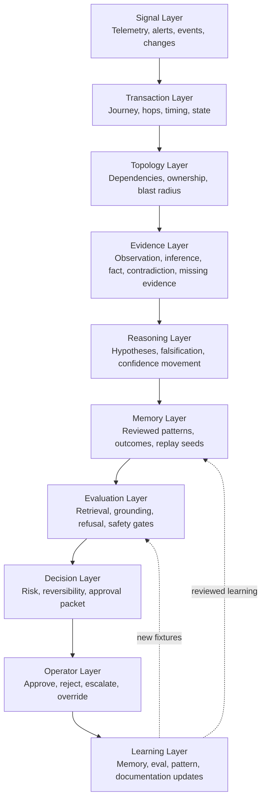
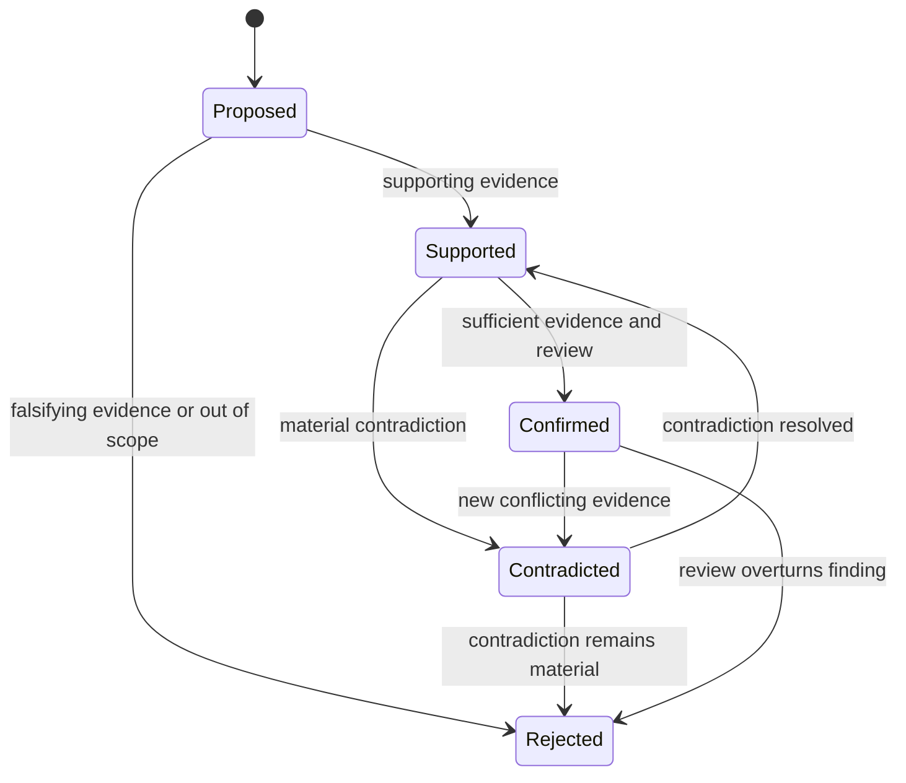
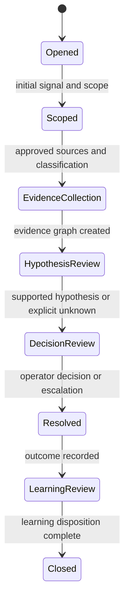
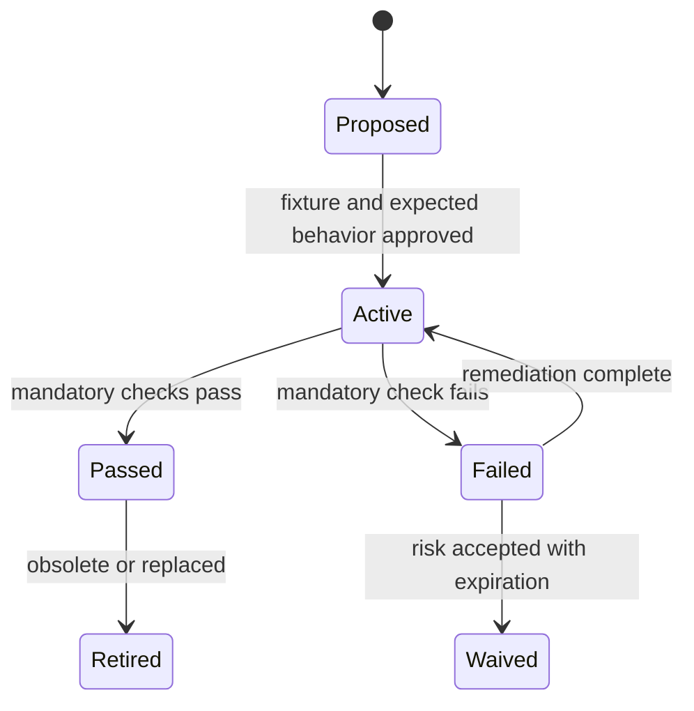
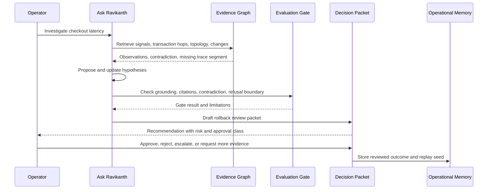
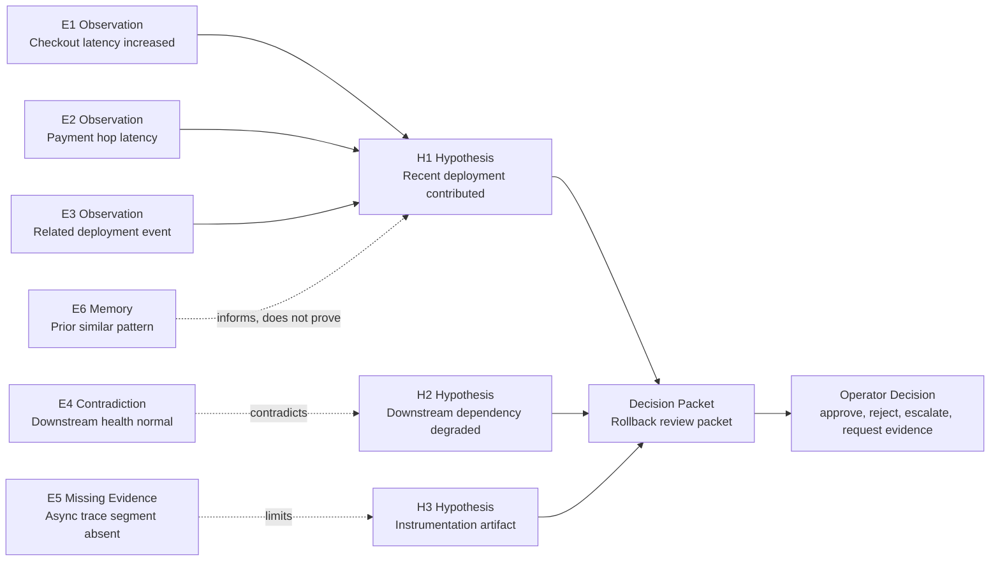
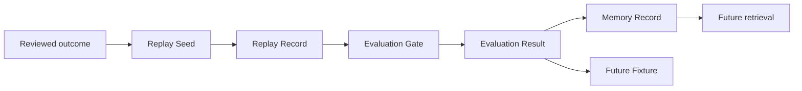
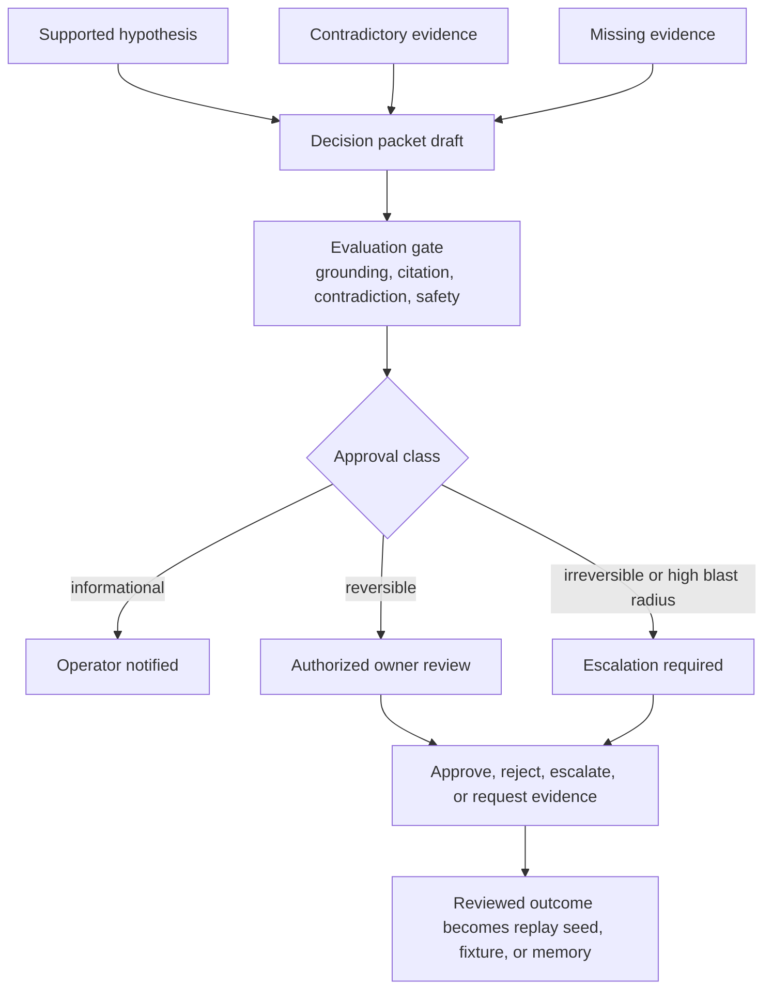

# Operational Intelligence Diagram Pack

Version: 1.0
Status: Publication-ready reference artifact
Updated: 2026-07-26

These diagrams make the Canonical Doctrine and Reference Architecture easier to inspect. They do not introduce new framework layers or terminology. Each diagram is a review aid, not an implementation mandate.

## Related References

- Canonical Doctrine: [/wiki/operational-intelligence-canonical-doctrine](/wiki/operational-intelligence-canonical-doctrine)
- Reference Architecture: [/wiki/operational-intelligence-reference-architecture](/wiki/operational-intelligence-reference-architecture)
- Operations Room: [/investigation-room](/investigation-room)
- Decision Packet Example: [/publication-pack/decision-packet-example.md](/publication-pack/decision-packet-example.md)
- OI-ROOM-001 Printable Walkthrough: [/publication-pack/oi-room-001-printable-walkthrough.md](/publication-pack/oi-room-001-printable-walkthrough.md)

## Diagram Index

| ID | Diagram | Reviewer question |
|---|---|---|
| OI-DIA-001 | Architecture flow | Can a reviewer trace a signal into a human decision without hidden leaps? |
| OI-DIA-002 | Hypothesis lifecycle | Are hypotheses allowed to be contradicted, rejected, and reopened? |
| OI-DIA-003 | Investigation lifecycle | Does an investigation move from scope to learning through reviewable states? |
| OI-DIA-004 | Evaluation lifecycle | Are gates versioned and allowed to fail, waive, retire, or reactivate? |
| OI-DIA-005 | OI-ROOM-001 sequence | Does the synthetic case preserve operator approval boundaries? |
| OI-DIA-006 | Evidence graph | Are observation, inference, contradiction, missing evidence, and decision separated? |
| OI-DIA-007 | Replay and learning loop | Does reviewed learning feed memory and future fixtures? |
| OI-DIA-008 | Decision packet handoff | Does the assistant hand a bounded packet to an accountable human? |

## OI-DIA-001 Architecture Diagram

Review note: the arrows are conceptual handoffs. A real implementation may parallelize layers, but it must preserve provenance, evidence state, evaluation, and operator approval before consequential action.

## OI-DIA-002 Hypothesis Lifecycle

Measurable output: each transition must record hypothesis ID, triggering evidence ID, state before, state after, reviewer or system actor, timestamp, and reason.

## OI-DIA-003 Investigation Lifecycle

Measurable output: each investigation must produce a decision packet, an explicit unknown, or a documented escalation. Silent closure is non-conformant.

## OI-DIA-004 Evaluation Lifecycle

Measurable output: gates report dimension-level results. A single aggregate trust score is insufficient.

## OI-DIA-005 OI-ROOM-001 Sequence Diagram

Review note: this sequence is intentionally synthetic and public-safe. It describes expected behavior, not a private production incident.

## OI-DIA-006 Evidence Graph Diagram

Edge semantics:

| Edge | Meaning | Required review behavior |
|---|---|---|
| supports | Evidence increases plausibility but does not prove causality alone | Keep hypothesis falsifiable |
| contradicts | Evidence conflicts with or weakens a hypothesis | Surface visibly and adjust state |
| limits | Missing or stale evidence reduces confidence | Do not hide uncertainty |
| informs | Prior memory provides context but not proof | Require current evidence |
| recommends | A hypothesis informs a decision packet | Preserve human approval boundary |

## OI-DIA-007 Replay and Learning Loop

## OI-DIA-008 Decision Packet Handoff

Non-conformance signal: an assistant directly executes a consequential action, suppresses contradiction, omits missing evidence, or presents a recommendation without owner, risk, reversibility, and fallback.
