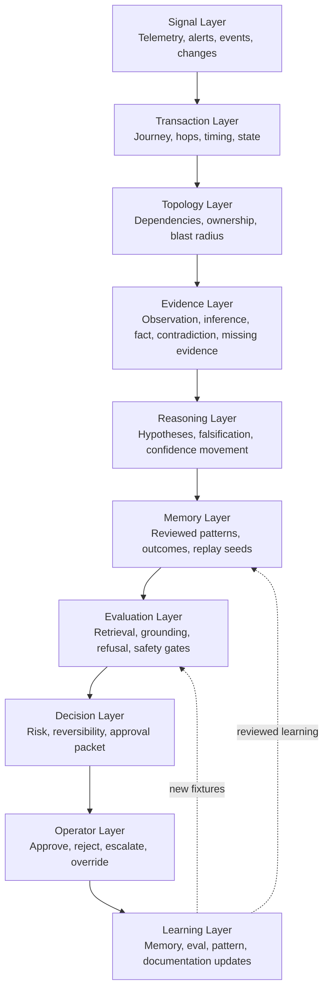
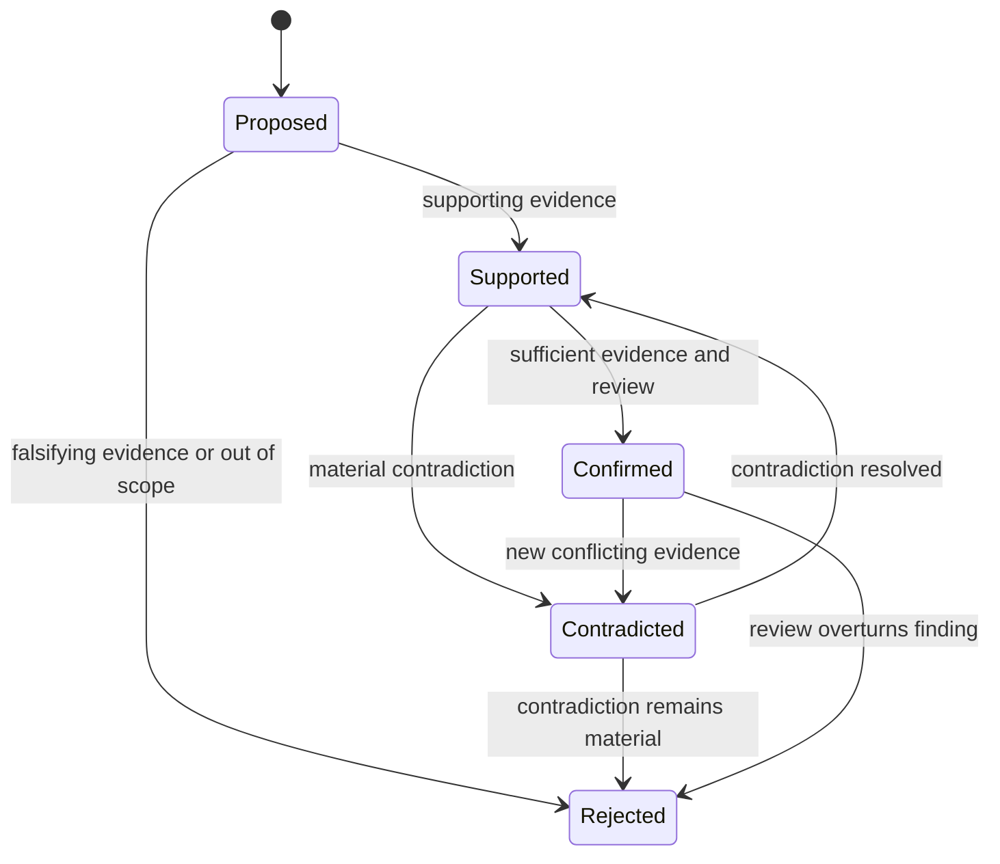
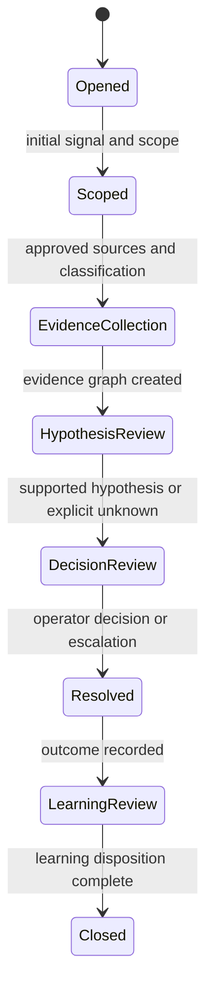
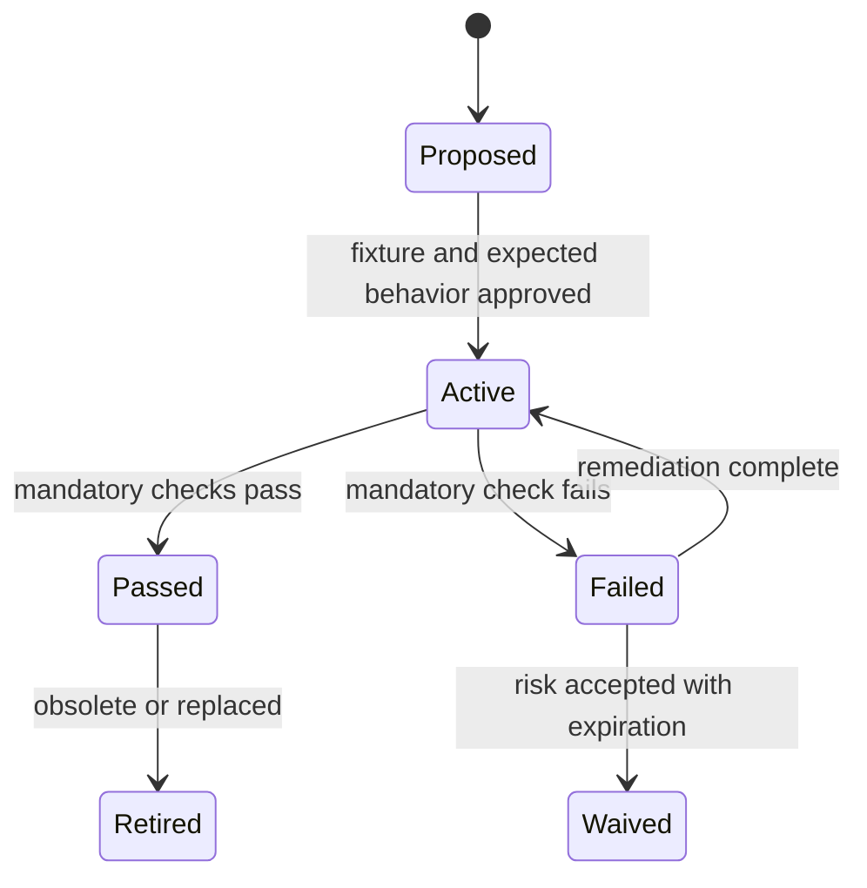
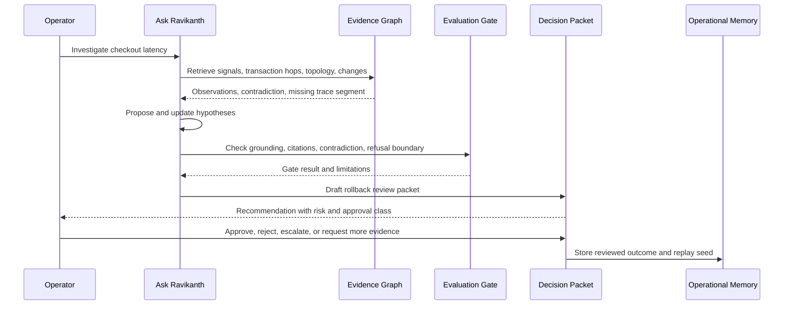
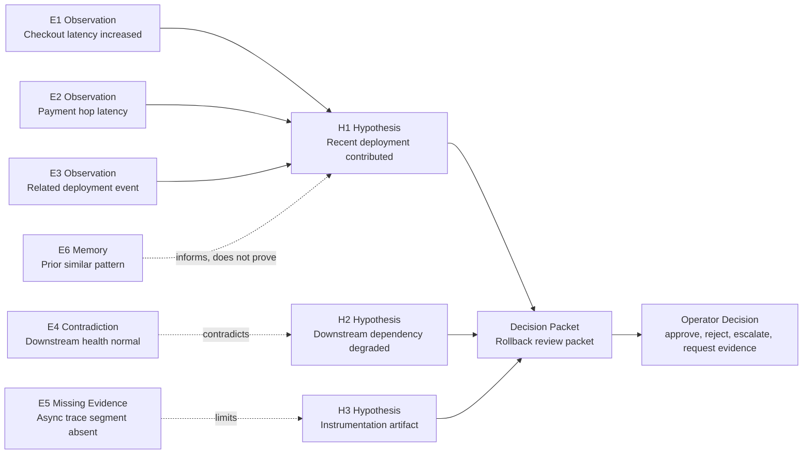
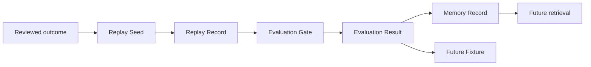

# Operational Intelligence Diagram Pack

Version: 1.0  
Status: Draft for Technical Review  
Updated: 2026-07-25

These diagrams make the Canonical Doctrine and Reference Architecture easier to inspect. They do not introduce new framework layers or terminology.

## Architecture Diagram

## Hypothesis Lifecycle

## Investigation Lifecycle

## Evaluation Lifecycle

## OI-ROOM-001 Sequence Diagram

## Evidence Graph Diagram

## Replay and Learning Loop

